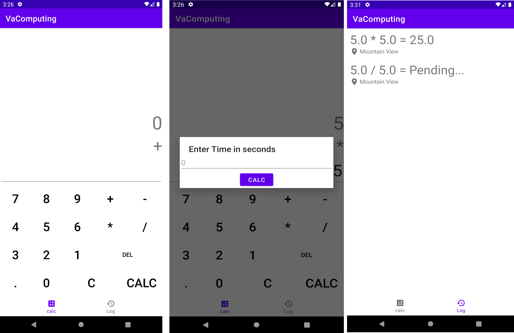

# VaComputing Calculator Engine

Va Computing is an App to calculate Math Equations after a specific time

<h2>Features</h2> 

Va Computing gives you the ability to calculate Math with:

- receive result after a specific time

- show all previous equations Results 

- show pending equation

- get GPS location that equation starts from

<h2>Prerequisites</h2>

- Compatible with Android SDK 21+.

- Make sure to enable `Unknown Sources` option in your settings before downloading the APK outside of Google Play Store.

<h2>Installation</h2>

- [APK](https://drive.google.com/file/d/1us_Fz9S19tpuOGuQQWxWqHyIkMUtjZPJ/view?usp=sharing)

<h2>Contributing</h2>

Pull requests and stars are always welcome. For bugs and feature requests, [please create an issue](../../issues/new).

<h2>License</h2>

Copyright 2021 Va Computing App

Licensed under the [MIT License](LICENSE.md)
